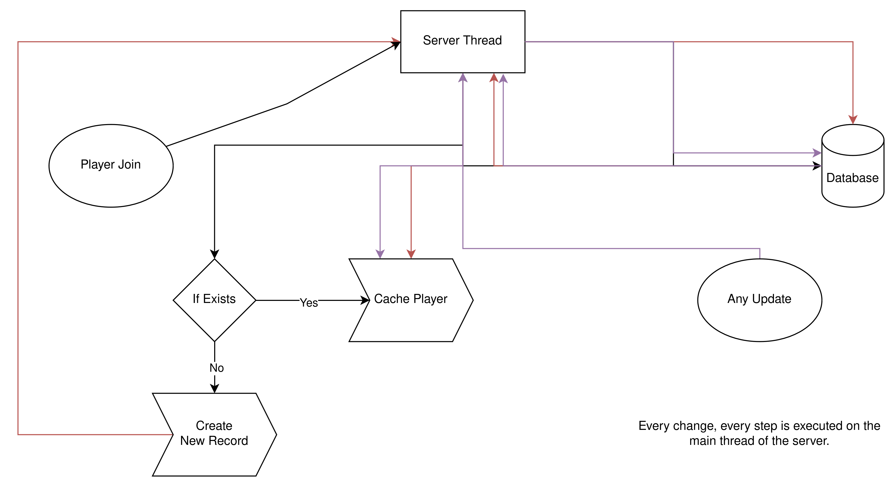
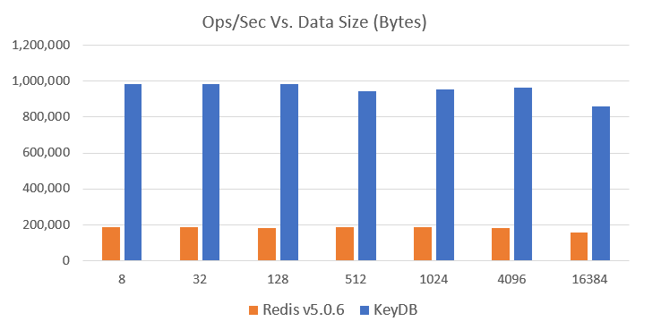
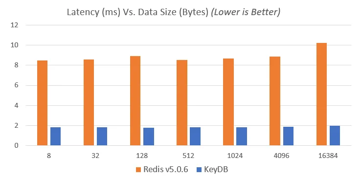
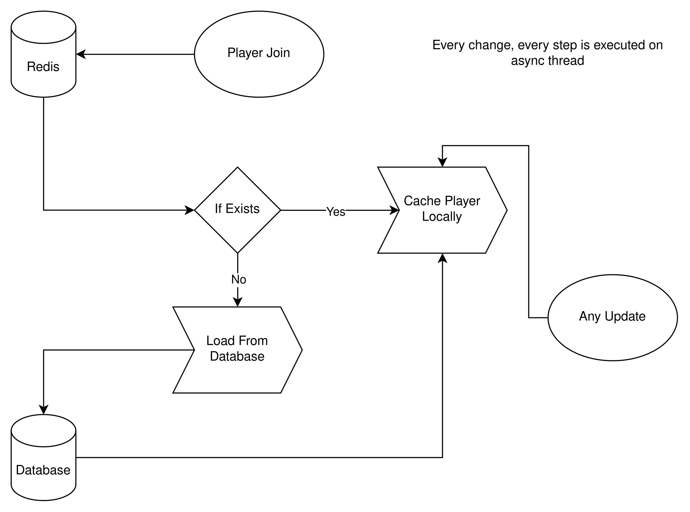
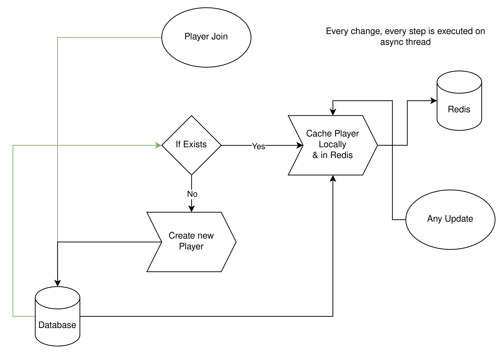

+++
author = "Vladimír Urík"
title = "Performance Economy"
date = "2024-03-03"
description = "How I made economy plugin for Minecraft Network more efficient"
tags = [
 "java",
 "bukkit",
 "velocity",
 "mysql",
 "redis",
 "minecraft"
]
categories = [
 "Engineering",
 "Minecraft",
]
series = ["Minecraft Development"]
aliases = ["performance-economy"]
image = "steve-johnson-YJGq5H9ofy0-unsplash.webp"
+++

## Introduction 
Most minecraft networks/servers have the Economy plugin. Most of the time the currencies are something like “Coins”, “Gems”, “Money”. So it’s from a user perspective which is basically always the same. He sees some currency and it’s hard to guess how it works exactly in the background. On smaller servers it basically doesn’t matter. But when you have a Minecraft Network it’s good to know how your global economy works and have it as optimized and “foolproof” as possible so that you don’t get various unwanted errors with duplication, unwanted deletion or overall data loss and so that the economy doesn’t tie up various services that are essential to your network. Such as a database.

## The Problem
As I mentioned before, most of the Economy plugins on the market work on the following principle. When a player connects to a server in the network, the plugin sends one query to get the user's data, then if the user doesn't exist it sends another query (Not only when the player connects, since the currency count has to be updated as well). Most of these plugins still work syncrhonically so they "lag" the server (Because minecraft plugins work on the main thread of the server.). Mainly we have to take into account that economics is not the only plugin that pulls the database when it joins and updates data. As I wrote, on smaller minecraft servers where you have one server this is a sufficient solution. But when you have a network and the player connects between servers (thanks to a proxy in our case Velocity) the number of requests to the database can grow quite a bit.

## The Solution
To solve this problem I needed something that could share cache between servers on the network. I was thinking about an http server but it would be slow enough for my solution. That's why I chose Redis.

> Redis is the open-source, in-memory data store used by millions of developers as a cache, vector database, document database, streaming engine, and message broker

But it is not enough to imply redis for my solution. The economy needs to be a bulletproof thing that doesn't fail and also doesn't crash the server. That's why I made it asynchronous (In other words, its functionality doesn't work on the main server thread.)
I have therefore proposed the following "double" functioning. The economy plugin will behave differently on proxies and differently on servers. You may ask why. When a player disconnects from the server it doesn't mean he has disconnected from the network. He could just move to another server registered under proxy. But besides that I chose keydb (fork of redis) which is several times more efficient and faster than redis.

Back to how the plugin works. When a player connects to the proxy, his data is loaded asynchronously from the database directly into redis. They will be stored locally in the proxy cache (to handle each player's economy) but also in redis. When the player then connects to the server under the proxy plugin, it will attempt to load the data from redis 3 times (in case it slows down for some reason or there is a large rush of players). If the data is not found in redis or fails to connect to redis, the plugin will pull the data from the database and cache it locally on the server (Everything outside the main thread of that server). This is so that the economy can run smoothly even if the connection to redis fails. In case we want to modify the player's economy, each change will be made asynchronously. If the player disconnects from the server the data from the server cache will be deleted, but still remain in the redis. They are only removed from the redis if the player also disconnects from the network, i.e. from the proxy.

## Conclusion
The economy plugin is now much more efficient and faster. It doesn't slow down the server and doesn't slow down the database. It is also much more reliable and doesn't lose data because I use safe sql queries.

 

## References
- KeyDB benchmark images and data [KeyDB is a Fork of Redis that is 5X Faster](https://medium.com/@tedmandarin/keydb-is-a-fork-of-redis-that-is-5x-faster-164757232bac)
- Why I choose redis instead of MySQL? [MySQL as Redis vs Redis?](https://dkomanov.medium.com/mysql-as-redis-vs-redis-74b788af9c6f)

## Acknowledgements
- Photo by [Steve Johnson](https://unsplash.com/@steve_j?utm_source=Vladimir-Urik&utm_medium=referral) on [Unsplash](https://unsplash.com/?utm_source=Vladimir-Urik&utm_medium=referral)
